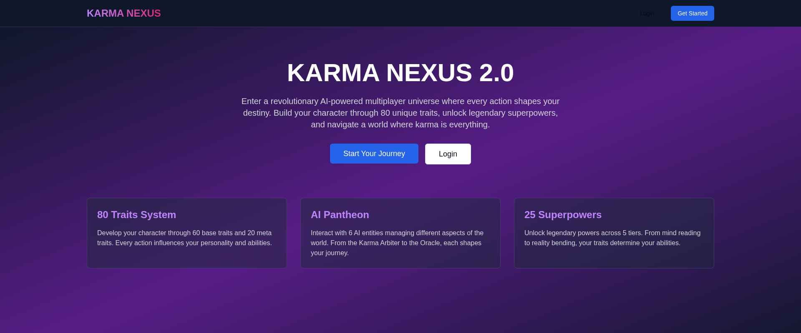
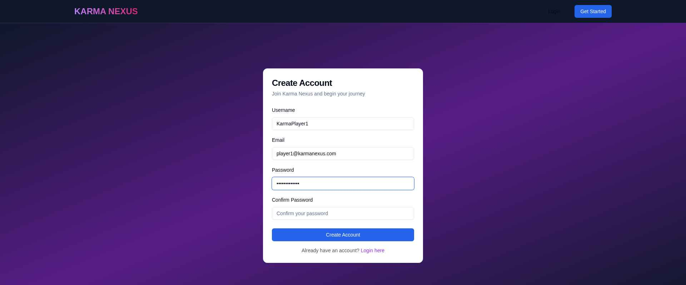
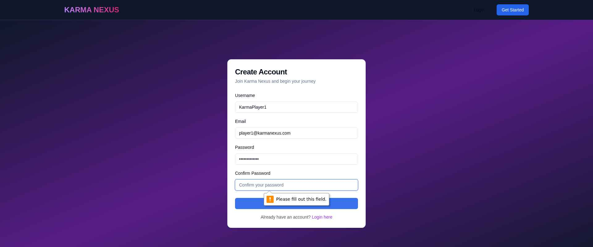

# 🌌 Karma Nexus 2.0 - Next Generation AI-Driven Multiplayer Game

### 🚀 Overview

Karma Nexus is a groundbreaking, AI-powered massively multiplayer karma-based RPG where every action shapes your destiny. Set in a futuristic world where payment chips are embedded in human hands, players navigate a complex society managed by multiple AI entities.

## ✨ Key Features

### Core Systems
- **80 Traits** - 20 Virtues, 20 Vices, 20 Skills, 20 Meta Traits
- **25 Superpowers** - 5 tiers of unlockable abilities
- **AI Pantheon** - 6 AI entities managing different game aspects
- **Real-time Multiplayer** - 50-100 concurrent players
- **Dynamic World Events** - Triggered by collective player karma

### Progression
- **Skill Trees** - 80 traits × 20 nodes each
- **Prestige System** - 10 prestige levels
- **Achievement System** - 1000+ achievements
- **Seasonal Battle Pass** - 100 tiers of rewards
- **Legacy System** - Cross-season progression

### Economy
- **6 Currency Types** - Credits, Karma Tokens, Dark Matter, Prestige Points, Guild Coins, Legacy Shards
- **Stock Market** - AI-managed market with dynamic pricing
- **Robot Marketplace** - 15 robot types to buy, sell, and trade
- **Crafting System** - Create and sell items

### Social
- **Guilds** - Create or join guilds (3-100 members)
- **Territory Control** - 20 territories to conquer
- **Guild Wars** - AI-managed warfare system
- **Alliances** - Form strategic partnerships
- **Marriage System** - Bond with other players
- **Mentor/Apprentice** - Guide new players

### Combat
- **Turn-Based Tactical Combat** - Strategic PvP and PvE
- **Arena Mode** - Ranked competitive battles
- **Robot Battles** - Pit your robots against others
- **Tournaments** - Weekly competitive events

## 🛠️ Tech Stack

### Backend
- **FastAPI** - High-performance async web framework
- **Python 3.11+** - Modern Python with type hints
- **Motor** - Async MongoDB driver
- **Pydantic** - Data validation
- **emergentintegrations** - Universal LLM integration
- **WebSockets** - Real-time communication
- **Redis** - Caching and session storage
- **Celery** - Background task processing

### Frontend
- **React 18.2+** - Modern UI framework
- **TypeScript 5.3+** - Type-safe development
- **Three.js** - 3D graphics rendering
- **@react-three/fiber** - React renderer for Three.js
- **Tailwind CSS** - Utility-first styling
- **Shadcn UI** - Beautiful component library
- **Zustand** - State management
- **Socket.io-client** - Real-time WebSocket client
- **React Query** - Server state management
- **Framer Motion** - Animation library

### Database
- **MongoDB** - Primary database
- **Redis** - Caching layer

## 🎮 Screenshots

### Landing Page
The main landing page welcomes players to the Karma Nexus universe with a stunning gradient background and clear call-to-action buttons.



### Registration
New players can easily create an account with a clean, intuitive registration form.


### Account Creation
The registration process validates all inputs and provides clear feedback to users.





## 🚀 Quick Start

### Prerequisites
- Python 3.11+
- Node.js 18+
- MongoDB 5.0+
- Redis 5.0+
- Yarn package manager

### Installation

1. **Clone the repository**
   ```bash
   git clone <repo-url>
   cd karma-nexus
   ```

2. **Backend Setup**
   ```bash
   cd backend
   python -m venv venv
   source venv/bin/activate  # On Windows: venv\Scripts\activate
   pip install -r requirements.txt
   cp .env.example .env
   # Edit .env with your configuration
   ```

3. **Frontend Setup**
   ```bash
   cd frontend
   yarn install
   cp .env.example .env
   # Edit .env with your configuration
   ```

4. **Start Services**
   ```bash
   # Terminal 1: Backend
   sudo supervisorctl restart backend

   # Terminal 2: Frontend
   sudo supervisorctl restart frontend
   ```

5. **Access the Application**
   - Frontend: http://localhost:3000
   - Backend API: http://localhost:8001
   - API Docs: http://localhost:8001/docs

## 🧪 Testing

### Backend Tests
```bash
cd backend
pytest
pytest --cov=. --cov-report=html  # With coverage
```

### Frontend Tests
```bash
cd frontend
yarn test                    # Unit tests
yarn test:coverage          # With coverage
yarn test:e2e               # E2E tests with Playwright
yarn test:e2e:ui            # E2E tests with UI
```

### Load Testing
```bash
cd backend/tests/performance
locust -f locustfile.py
# Open http://localhost:8089
```

## 📚 Documentation

- **[Game Design Document](./idea.md)** - Complete game design
- **[Implementation Status](./implementation_status.md)** - Technical blueprint
- **[Project Structure](./PROJECT_STRUCTURE.md)** - File organization
- **[Development Phases](./phases.md)** - Progress tracking
- **[API Documentation](http://localhost:8001/docs)** - Interactive API docs

## 🎯 Project Progress

### Completed Phases
- ✅ Phase 1: Foundation (100%)
- ✅ Phase 2: Core Mechanics (100%)
- ✅ Phase 3: AI Integration (100%)
- ✅ Phase 4: Progression (100%)
- ✅ Phase 5: Social & Guilds (100%)
- ✅ Phase 6: Combat & PvP (100%)
- ✅ Phase 7: Economy & Robots (100%)
- ✅ Phase 9: World & Events (100%)
- ✅ Phase 10: Seasonal & Meta (100%)

### In Progress
- 🚧 Phase 8: Quests & Content (43%)
- 🚧 Phase 11: Polish & Testing (31%)

### Upcoming
- ⏳ Phase 12: Launch Prep (0%)

**Overall Progress: 79%** (493/850 files)

## 👥 Contributing

1. Fork the repository
2. Create a feature branch (`git checkout -b feature/amazing-feature`)
3. Commit your changes (`git commit -m 'Add amazing feature'`)
4. Push to the branch (`git push origin feature/amazing-feature`)
5. Open a Pull Request

## 📝 License

This project is proprietary and confidential.

## 👥 Team

- **Game Design** - Comprehensive karma-based RPG system
- **AI Integration** - Multiple AI agents for dynamic gameplay
- **Full-Stack Development** - FastAPI + React + MongoDB
- **3D Graphics** - Three.js integration
- **Real-time Systems** - WebSocket implementation

## 🚀 Deployment

### Production Build

```bash
# Backend
cd backend
pip install -r requirements.txt
uvicorn server:app --host 0.0.0.0 --port 8001

# Frontend
cd frontend
yarn build
# Serve the build directory with a web server
```

### Environment Variables

See `.env.example` files in backend and frontend directories.

## 🔧 Troubleshooting

### Backend Issues
- Check MongoDB connection: Verify MONGO_URL in backend/.env
- Check Redis connection: Ensure Redis is running
- Check supervisor logs: `tail -f /var/log/supervisor/backend.err.log`

### Frontend Issues
- Check backend URL: Verify REACT_APP_BACKEND_URL in frontend/.env
- Clear cache: `rm -rf node_modules yarn.lock && yarn install`
- Check supervisor logs: `tail -f /var/log/supervisor/frontend.err.log`

### Test Issues
- Ensure test database is running
- Check test configuration in pytest.ini and jest.config.js
- Run tests in isolation: `pytest -v -s tests/unit/test_specific.py`

## 📧 Support

For issues and questions:
- Create an issue on GitHub
- Contact the development team
- Check documentation in `/docs`

## 🎉 Acknowledgments

- Emergent Platform for LLM integration
- Open source community for amazing tools
- All contributors and testers

---

**Built with ❤️ using FastAPI, React, and MongoDB**

*Last Updated: Current Development Cycle*
